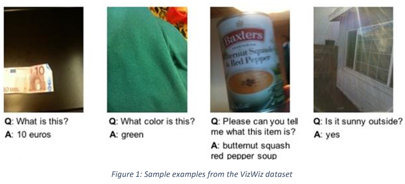

# CLIP-Linear VQA: Efficient Fixed-Vocabulary Visual Answering


## Overview

This project is a **Visual Question Answering (VQA)** web application that takes an image and a textual question as input and returns an answer based on the visual and textual context. It is powered by a combination of **PyTorch**, **CLIP (Contrastive Language-Image Pretraining)**, and a custom neural network.

The web application consists of:
- **Backend:** Built with Flask, hosting the VQA model and handling predictions.
- **Frontend:** Built with React, providing an intuitive user interface for uploading images, asking questions, and getting answers.

<p align="center">
  
</p>
---

## Features

- **Advanced VQA Model:** Combines CLIP embeddings with a custom neural network to generate accurate answers.
- **Multi-class Classification:** Supports 5410 answer classes.
- **Answerability Scoring:** Provides a confidence score indicating whether the question is answerable based on the input image.
- **Text-to-Speech (TTS):** Listen to the answer with a single click.
- **Interactive UI:** Simple and responsive user interface built with React.
- **Deployment-Ready:** Backend and frontend are fully integrated and ready for deployment.

---

## File Structure

### Backend
- `app.py`: Flask server handling routes and model inference.
- `vqa_model.py`: Custom VQA model leveraging CLIP features.
- `Saved_Models/`: Directory containing the trained model and encoders.

### Frontend
- `VQAApp.js`: React component implementing the main UI.
- `App.css` & `VQAApp.css`: Custom styles for the UI.

---

## Setup and Installation

### Prerequisites
- Python 3.12+
- Node.js (for the React frontend)
- PyTorch (with appropriate CUDA version if GPU is used)

### Backend Setup
1. Clone the repository:
   ```bash
   git clone https://github.com/your-username/vqa-webapp.git
   cd vqa-webapp/backend

2. Install Python dependencies:   
    ```bash
    pip install -r requirements.txt

3. Download the trained model and place it in the `Saved_Models/` directory

4. Run the Flask server:
   ```bash
   python app.py

### Frontend Setup 
1. Navigate to the frontend directory:
   ```bash
   cd ../frontend

2. Install dependencies:
   ```bash
   npm install

3. Start the React development server:
   ```bash
   npm start

 ---  

## Usage
1. Launch the backend (http://127.0.0.1:5000) and the frontend (http://localhost:3000)
2. Upload an image and type a question in the web interface.
3. Click "Get Answer" to receive the response.
4. Optional) Click the 🔊 button to hear the answer.

---   

## Model Details
The model architecture combines CLIP embeddings with a multi-layer neural network:
 ### Input Features:
 - CLIP visual and text embeddings.
 ### Architecture:
 - Two linear layers with dropout and layer normalization.
 - Separate branches for answer type prediction, answer mask generation, and answerability scoring.
 ### Output:
 - Multi-class classification for answer prediction and answer type.

 ---  

## Example Workflow
1. ### Input: 
- Image: A photo of a cat sitting on a sofa. 
- Question: "What is the object on the sofa?"

2. ### Output:
- Answer: "Cat"
- Answer Type: "Object"
- Answerability: 0.95 (High confidence)

---

## Contributing
Contributions are welcome! Please open an issue or submit a pull request.

---


